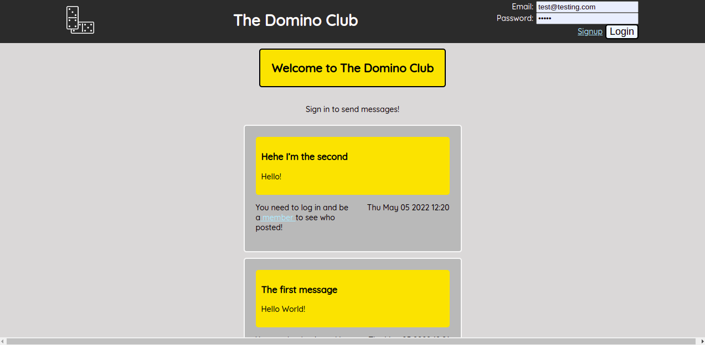
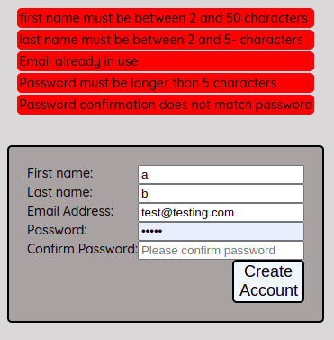
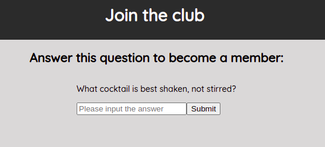

# The Domino Club

## A members only project

A Node.js project which utilises passportJS to deliver an experience of an exclusive club, where anyone can post messages, however only members can see who wrote them. Users must sign in and are authenticated to view member's names.


[Live Demo](https://domino-club.herokuapp.com/)



Form validation:





 ## Installation 
 ```bash
git clone git@github.com:zakia98/the-domino-club.git
cd the-domino-club
npm install
npm run build
```
Then it is possible to host the website on your preferred hosting platform. If heroku, do: 
```bash
heroku create
git push heroku main
```

### Setup
Users will need to set the following environment variables when deploying to production:

- `NODE_ENV`
- `DB_URL`

`DB_URL` provides the database which the application will use.


## Functionality
- Users that are signed in are able to make posts
- Users can sign up, and their responses are validated.
- Only members can see who wrote each post.
- To become a member, users need to enter a secret passphrase to join the club.
- Implemented admin functionality, admins can delete posts.


## Technologies
- Node
- Express
- MongoDB


